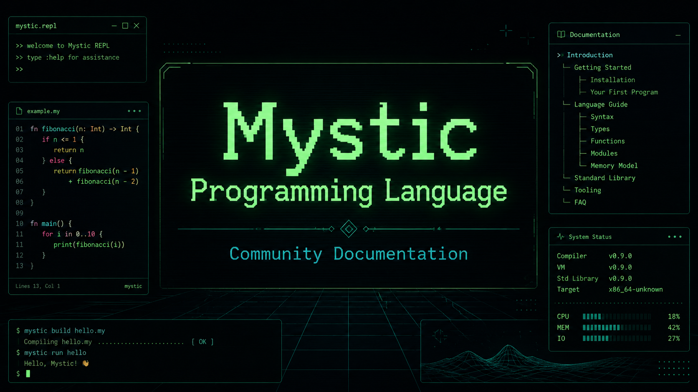

  

# Mystic MPL Documentation

Modern documentation, examples, and reference material for Mystic Programming Language, commonly used with Mystic BBS.

This project is intended to make MPL easier to learn, maintain, and use for Mystic BBS development.

## Documentation

The primary documentation is maintained in the project wiki.

- [Wiki Home](https://github.com/Pequito/mystic-mpl-docs/wiki)
- [Getting Started](https://github.com/Pequito/mystic-mpl-docs/wiki/Getting-Started)
- [Installing and Compiling](https://github.com/Pequito/mystic-mpl-docs/wiki/Installing-and-Compiling)
- [Your First MPL Program](https://github.com/Pequito/mystic-mpl-docs/wiki/Your-First-MPL-Program)
- [MPL Syntax](https://github.com/Pequito/mystic-mpl-docs/wiki/MPL-Syntax)
- [Variables](https://github.com/Pequito/mystic-mpl-docs/wiki/Variables)
- [Procedures](https://github.com/Pequito/mystic-mpl-docs/wiki/Procedures)
- [Functions](https://github.com/Pequito/mystic-mpl-docs/wiki/Functions)
- [Documentation Status](https://github.com/Pequito/mystic-mpl-docs/wiki/Documentation-Status)

## Goals

- Provide clean MPL syntax documentation
- Build practical examples for common Mystic BBS tasks
- Document common patterns used in Mystic MPL scripts
- Create a useful reference for new and returning MPL developers
- Preserve Mystic MPL knowledge in a more accessible format

## Current Status

The documentation is under active development. Some pages may be incomplete or require verification against specific Mystic BBS releases.

Current focus areas include:

- Getting started with MPL
- Language syntax and program structure
- Variables, constants, data types, procedures, and functions
- Compiler usage and behavior
- ANSI and screen output
- Menu integration
- File handling
- User data access
- Practical examples and common patterns

See the [Documentation Status](https://github.com/Pequito/mystic-mpl-docs/wiki/Documentation-Status) page for detailed progress and verification information.

## Contributing

Corrections, tested examples, version notes, and clarification of undocumented behavior are welcome.

Review the [Contributing Guide](CONTRIBUTING.md) before submitting changes.

## Project Links

- [Wiki](https://github.com/Pequito/mystic-mpl-docs/wiki)
- [Contributing Guide](CONTRIBUTING.md)
- [License](LICENSE)

---

Mystic BBS and Mystic Programming Language are the property of their respective owners. This documentation is an independent community project.
